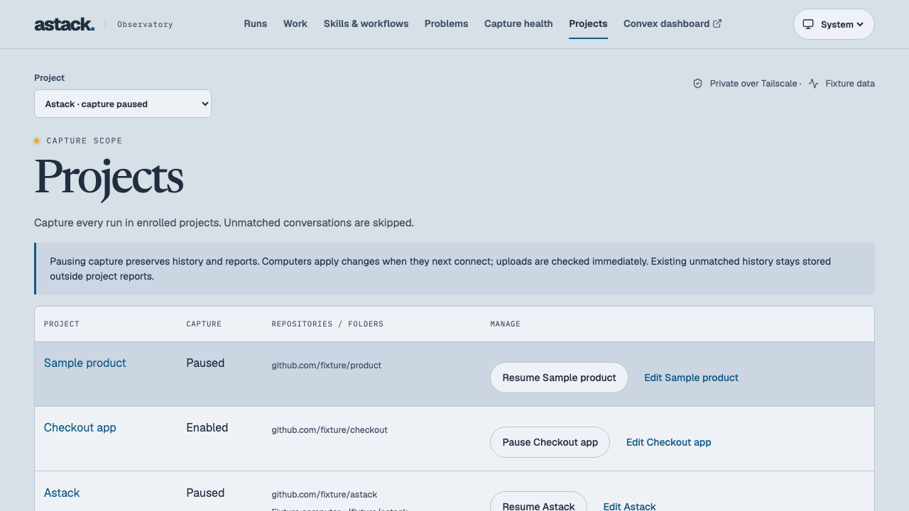
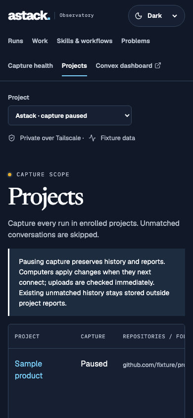
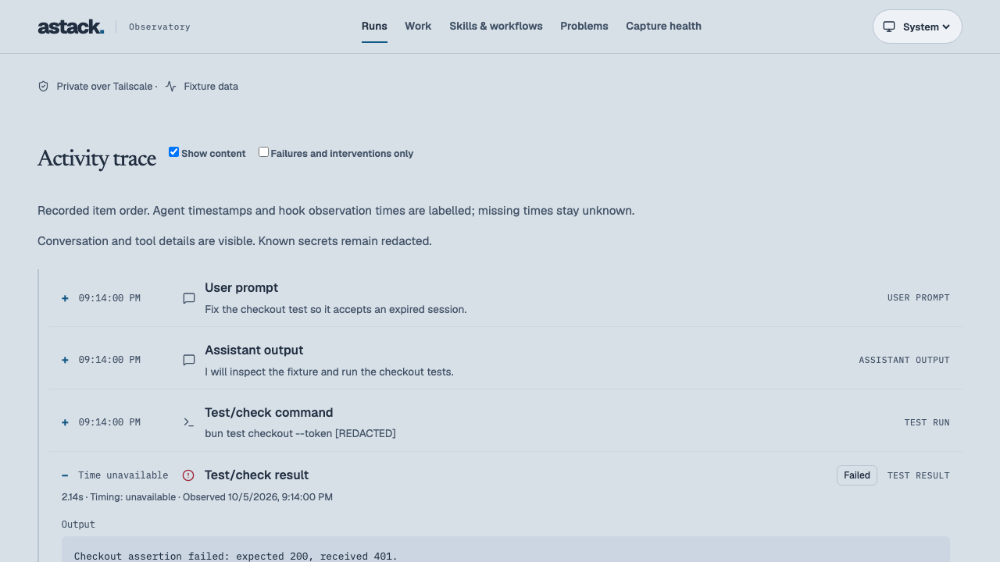
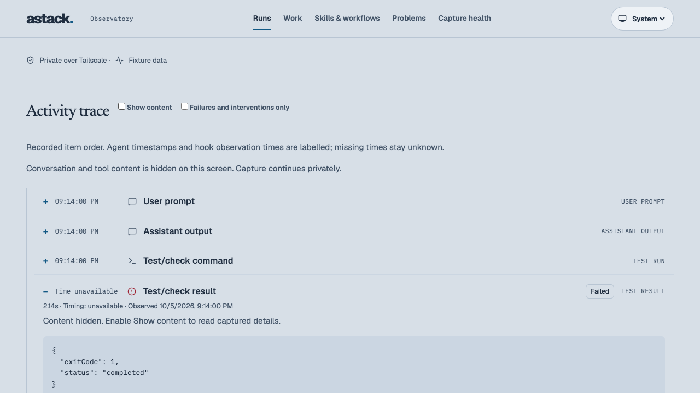
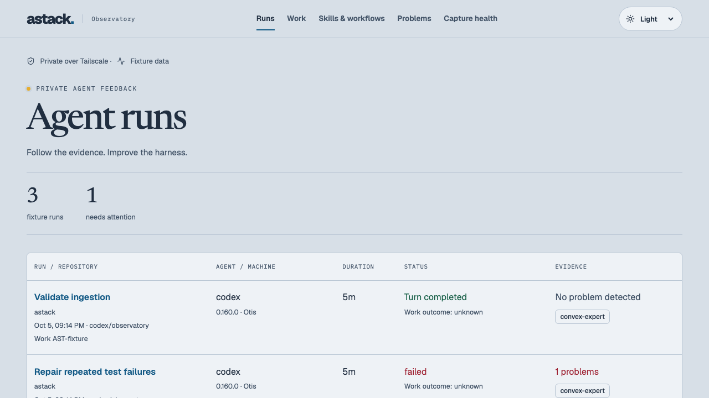
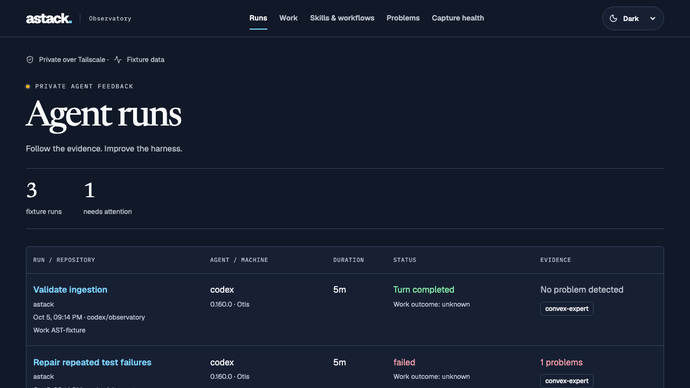
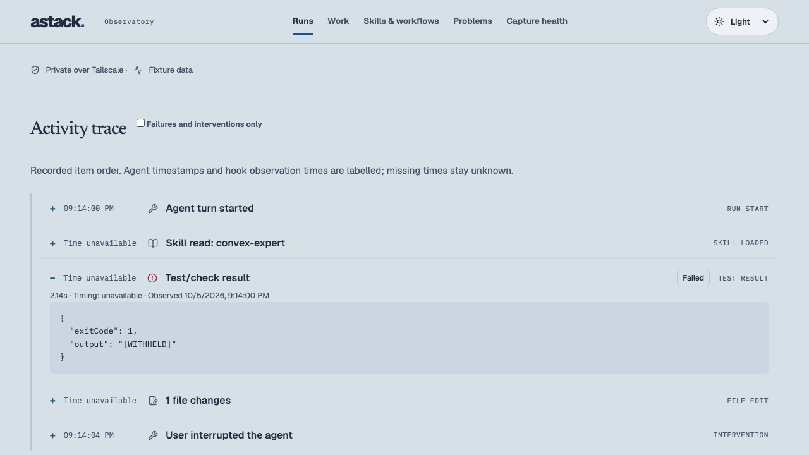

# Agent Observatory evidence

## Dynamic worktree fallback, 2026-10-06

Implemented and installed collector source `836f8c0` on Otis. Missing native repository origins now resolve through local Git configuration before full turns are requested, including shared linked-worktree and worktree-specific configuration. The canonical origin is retained with the run and marked as a capture-time local observation. Provided native origins remain authoritative; historical branch/commit facts are not reconstructed. Trusted early hooks use the same lookup. See acceptance **G1–G4** in [project capture](project-capture.md).

- Strict types, **37 tests / 197 assertions** and site/plugin checks passed. Five new tests use actual temporary Git repositories, randomly named detached worktrees outside registered folders, subfolders, changed/shared/worktree-specific origins, credential-bearing URLs, inherited Git/global/include overrides, missing/invalid origins and a real FIFO Git configuration killed within the lookup budget.
- A missing-metadata adapter fixture requests full turns only after a repository-only match. Unregistered, missing-checkout and conflicting-native cases are excluded, while recorded native origins still match a removed checkout. The recovered run passes through SQLite and a real local HTTP server into the actual Convex function definitions using `convex-test`; a fresh owner query reads two scoped runs and the recovered canonical repository. No synthetic production run was inserted.
- An early trusted-hook fixture resolves its unlisted worktree before a native snapshot exists; paused policy stores no observation. The signed compiled collector separately passed this fixture at its real CLI entry point. A read-only check resolved the actual Astack checkout through Git and matched its real cached enrollment with all folder fallbacks removed.
- The signed binary was installed atomically and supervision restarted. Capture checkpoints were reset while preserving configured history cutoff, queue, identities and retained telemetry. Fresh policy, source and forwarding health report `ok`; both source checkpoints completed. Two projects were enabled at rollout. The eligible upload queue decreased from 41,044 to 39,512 during observation and remains in background replay. No recovered production run requiring the new fallback had yet been observed; the induced missing-metadata proofs above establish that branch separately.
- Deployed owner read, anonymous project read/write denial, authorized machine policy, unregistered-upload rejection and wrong-project run/trace denial passed. Backend/UI contracts and deployed web assets did not change. Git reference behavior was checked against the official [worktree configuration](https://git-scm.com/docs/git-worktree#_configuration_file) and [configuration scopes](https://git-scm.com/docs/git-config#SCOPES) documentation, plus Git 2.54.0 on Otis.

Self-review checked the pre-content capture gate, native-metadata precedence, backend/queue matching evidence, secret removal before persistence, scope ambiguity and failure handling. Git lookup has a one-second deadline, 8 KiB output budget, no shell or network operation, no configuration includes or global/system/inherited Git overrides, and no diagnostic logging. Lookups cache only during a poll. Deleted checkouts without native origin metadata remain unidentified unless an explicit folder matches. Pen/Storybook and a repeated browser journey are skipped for this collector-only change; the preceding UI proof is unchanged. Optional hooks remain uninstalled/untrusted on Otis, and MacBook installation remains deferred.

## Project capture and reports, 2026-10-06

Implemented and deployed source revision `62955e3` on Otis, based on `9b82856`. This narrows the original system-wide capture decision to explicitly enrolled projects. Projects now have stable portable identities, names, repository matches and computer-specific folder roots. The selector scopes Runs, Work, Skills, Problems and their drill-downs; global reports combine enrolled history. Pausing preserves reports while denying new ingestion. See the [project contract](project-capture.md).

| Acceptance | Observed result |
| --- | --- |
| P1 | Owner registration, editing, duplicate-repository rejection and anonymous/wrong-owner denial pass in native-function tests. Astack was enrolled through the deployed owner API; the live browser edited/saved that existing definition and observed the reactive roster. No synthetic project was saved in production. Registered computers are selectable before their first captured run. |
| P2 | An isolated supported-reader test proves that full turns are never requested for initial empty, unmatched or paused policies, and are requested after enrollment. Real collector policy/source health reports `ok` with one enabled project. Thread metadata is enumerated across all configured sources; this may contain previews, but excluded full turns are not fetched or persisted. |
| P3 | Collector regressions cover excluded queues, early orphan hook events restored after an approved parent, parent-before-event upload order and work bindings unable to replace enrolled classification. Backend tests reject unmatched/forged/orphan/paused records. Deployed machine policy returned 200 with authorization, 401 without it; an unregistered upload returned 400 and was not stored. |
| P4 | Domain tests cover SSH/HTTPS normalization, credential removal, explicit ports, clone/worktree identity, machine-specific roots, path boundaries and conflicting evidence. Duplicate repository enrollment through another transport is rejected. The aggregate configuration budget is tested. |
| P5 | Scoped native queries and capability deltas pass across replay, stale updates and reassignment without double counting. Wrong-project direct run/trace reads are hidden in both tests and the deployed service. Seven fixture browser tests pass, including add/edit/pause, selector, unsaved-error/loading/empty states and narrow dark rendering. The live browser preserves project scope through run, work, skill and problem navigation. |
| P6 | A permission-restricted Convex export was made before assignment. The bounded native history pass matched 108 Astack runs and retained 1,214 unmatched runs outside reports. Both selected/global enrolled queries showed 108 runs at that observation, with 48 loaded skill groups. Tests prove repeatable migration and unmatched retention. The eligible collector backlog drained to zero; later small pending counts are normal new observations. No source or existing telemetry was deleted. |

Strict types, all **32 tests / 168 assertions**, UI lint, public site/plugin checks, production UI and signed collector builds, Storybook build, **7 fixture browser tests** and **1 authenticated deployed UI journey** passed. Native owner read, anonymous project read/write denial, machine policy access, unmatched upload denial and wrong-project drill-down denial passed. Docker backend/web/dashboard health passed; served HTML and JavaScript exactly match the final production build. Browser tests preceded a final health-copy clarification from “contents” to “full turns”; the final copy built and served successfully. Vite reports the 500 kB chunk advisory (production JS 529.72 kB / 155.68 kB gzip); it does not fail the build.

Applied the Convex reviewer checklist as **self-review**, checking owner/machine boundaries, argument/return validators, internal visibility, bounded indexed reads/writes and scheduled migration, project/global rollup deltas and revision replay. Review fixes include aggregate project configuration bounds, duplicate repository rejection, orphan-event replay and preserving classified project identity during manual work binding. Their regressions pass. The policy endpoint returns normalized repositories and only the requesting computer's folders; it returns no telemetry or credential hashes. Migration has no public invocation.

Offline collectors use the last accepted policy; backend pause enforcement is immediate, while local policy changes wait for reconnection. Fresh machines without a policy capture no turns. Optional hooks without a matching folder or previously observed repository context are skipped. MacBook installation remains the owner's deferred action; its guide now includes project enrollment. No new reboot or physical second-machine proof is claimed. Pen is skipped for this addition because the agreed layout and controls are reused; the original feature's separate Pen comparison gap still keeps the overall PR draft.

These captures contain synthetic data. Astack is paused only in the fixture; the real enrolled Astack project is enabled.

## Dashboard navigation link, 2026-10-06

Added **Convex dashboard** to the shared authenticated navigation, opening private port 8453 in a new tab with `noopener noreferrer` and no credential in the URL. On the working tree based on `72feb86`, UI lint, strict types and all 22 tests, production/Storybook builds, five existing synthetic browser tests, one authenticated deployed UI journey and site/plugin checks passed. Direct browser inspection confirmed the link destination/new-tab attributes and no horizontal overflow at 1051px and 390px. Otis's served HTML and JavaScript exactly matched the built UI; Observatory and the dashboard returned HTTP 200. Only web assets were deployed. The existing navigation layout is reused, so no separate Pen exploration or new component story was needed.

## Convex admin dashboard, 2026-10-06

Installed the official Convex dashboard pinned at `sha256:f85cf0d0448b9c835ae3df5c7c1c6f0145dd4c8f0f92eb0245daf304efdd9f1a` alongside the existing backend. Docker binds it only to `127.0.0.1:6792`; Tailscale Serve exposes private HTTPS on port 8453. The container health check passed, the HTTPS page returned 200, and the browser displayed the Convex login form with the correct deployment URL (`https://otis.tail12a0a0.ts.net:8451`). The existing private admin key successfully listed the five expected tables through the native CLI. Credentials were copied directly to the local clipboard without being printed; browser sign-in is left to the owner. This dashboard uses the actual Observatory database.

Strict types, all 22 tests and the existing site/plugin checks passed. Deployment now synchronizes the runtime Compose definition and establishes the dashboard route; the existing login startup starts the new service. Pen/Storybook are not applicable to the unchanged vendor UI; HTTP, container health and the observed login page establish startup. No authenticated browser dashboard session or post-reboot test is claimed.

## Readable content update, 2026-10-06

Implemented and deployed revision `2eeebee` on Otis. This supersedes the initial metadata-only privacy decision below. New collectors default to redacted content; explicit existing metadata-only settings remain respected. Otis enables readable capture and includes its separate viewer credential in private known-secret matching. Trace titles remain metadata, with readable previews and expanded Message/Command/Output/Arguments/Result/Error sections controlled by Show content.

- Strict types, all 22 domain/collector/native-backend tests, UI lint and public site/plugin checks passed. New cases exercise readable/metadata-only replay with stable identities and first observation times, known secrets and nested/embedded JSON credentials, omitted reasoning, and the CLI capture setting. The production UI and signed portable collector built and deployed successfully.
- Five synthetic Storybook browser tests passed, including content visible by default, content removed from the DOM when hidden, status metadata retained, preference persistence after reload, restoration, and narrow dark rendering. The first attempt hit an ambiguous locator because it matched both a visible preview and the same text in a collapsed detail; narrowing to visible text resolved the test setup issue. Existing timing/filter/empty/theme/navigation checks remain green.
- One authenticated deployed UI journey passed. It observed real readable previews, their removal when Show content was disabled, restored content, run/work/skill navigation, and localStorage containing only theme and visibility preferences. Keys/JWTs and conversation content are not stored there.
- Native private-service proof passed all missing/wrong-identity and machine-credential denial cases and read a persisted trace with redacted content. A fresh owner query for the user's open run confirmed 18 events, including 4 readable message fields, 5 commands and 5 outputs. The first runs page contained 20 runs marked for content capture at that observation.
- All 1,322 locally retained runs were re-read with content enabled. The history refresh is queued with existing IDs; pending uploads decreased from 86,065 to 84,091 while capture and forwarding reported `ok`. Complete historical delivery is not claimed. The open run and recent runs were prioritised and verified in the native backend.
- One replay attempt reported `capture_unavailable` and the collector recovered on its next attempt. Simultaneous normal and operator-priority forwarding caused a native optimistic-concurrency retry failure on the shared machine row; sequencing the uploads resolved it, with queued revisions retained. The normal supervised collector is running again.
- Applied the Convex reviewer checklist as self-review to the retained data/auth boundaries: the existing authenticated, paginated query and ingestion paths accept the already-supported event JSON shape. No schema or function change was required. Permitted/denied native calls and revision replay passed.

Pen is skipped for this addition because it reuses existing trace controls/layout; Storybook and the running deployment cover its states. The original feature's separate Pen comparison gap still keeps the overall PR draft. Remote Observatory, site and plugin CI passed for `2eeebee`; the broader foundation reference check is reported by the PR checks.

## Initial feature and appearance proof, 2026-10-05

Environment: Otis/macOS arm64, Bun 1.4.0, Node 24.21, Codex CLI 0.160.0, Convex SDK 1.46.0. Date: 2026-10-05. Initial collector/backend/native-service proof applies to `a201b49`, with current main incorporated at `6264517`. Appearance, bundled fonts, four component browser tests and the deployed UI journey apply to `43fad6c`; the deployed UI source matches that commit. Strict types, 19 domain/collector/backend tests, UI lint and existing site/plugin checks passed after the theme changes. This revision annotation changes documentation only. Raw private reports remain ignored under `.proof/agent-observatory` and `.e2e-live`.

| Acceptance | Observed result |
| --- | --- |
| CAPTURE | A compiled, supervised collector reads real persisted Desktop turns from the local app-server and all configured source kinds/archives. The source reports `ok`. Full-history capture held 1,315 turns and 105,530 events locally; the pending queue decreased from 93,198 to 91,238 as native ingestion progressed. A real first page contained 31 runs with capability evidence and 58 capability groups were available. Native tools, failures and traces were present. Historical forwarding remains in progress in bounded batches; capture completeness is not claimed. |
| PORTABLE | The compiled collector runs from the permanent private runtime without the source worktree or web app. Adapter types remain outside the shared domain. A native-CPU MacBook installer/enrollment flow is supplied. MacBook installation is explicitly deferred by its owner. |
| PRIVACY | V1 rejects raw-content mode. Tests cover nested credential keys, environment assignments, known secrets, bearer tokens, URLs and private keys. Disk reopen proves only redacted records remain. Large-detail omission, byte-bounded batching and non-blocking hashing of a real FIFO are tested. Public screenshots contain fixtures only. |
| OFFLINE | A real local HTTP 503 followed by success retains/replays a SQLite queue across close/reopen. Concurrent revision updates survive old acknowledgements; unchanged replays deduplicate. A wrapper test preserves agent stdout and exit code 3 while associating work. |
| PRIVATE | Actual self-hosted functions pushed successfully. Missing/wrong viewer credentials, absent machine credentials and machine-key UI access were denied. Anonymous native queries were denied; the owner received a verified UUID-subject JWT and read stored traces. Tailscale stripped a forged owner identity header (401). Docker ports bind only loopback; Serve endpoints are tailnet-only. |
| LINKS | Tests bind work/project context to completed runs immediately and preserve it across later snapshots. JSON launch events bind automatically. Workflow/outcome annotations queue locally. Current Astack has no actual COS launcher/work store; no real work-store integration is claimed. |
| TRACE | Four deterministic Storybook browser tests cover expansion, failures/interventions filtering, missing timing/privacy, empty state, desktop/narrow light/dark rendering and theme persistence. A separate actual private UI test covers auth gating, filtered run → trace, Work, Skills, exact-version drill-down, Problems and Capture health. Only the theme preference appears in production localStorage; authentication remains in memory. |
| FEEDBACK | Function/domain tests establish matching-failure thresholds, unknown outcome, no inferred intervention from ordinary prompts, exact version grouping, idempotent rollups, stale revisions, pagination and independent machine credentials. Legacy unknown start times are not measured as long-running work. |
| PERSISTENCE | Restarted the actual backend and confirmed the identical completed run remained queryable. Container health recovered, collector forwarding resumed, and the recent-history queue drained to zero before full historical backfill was enabled. The deployment starts via a user LaunchAgent/OrbStack at login; machine reboot was not exercised. |

The local check set is `bun run check`, `bun run observatory:check` (19 tests), `bun run observatory:lint`, production UI/collector builds, Storybook build and 4 browser tests, native private-service proof and 1 deployed UI browser test. CI runs the public/synthetic subset without private credentials; its remote result belongs to the PR checks, not this local observation.

The owner-requested appearance refinement matches the actual Astack reference in light/dark tokens, bundled type families and compact top navigation. Theme persistence and system-mode changes were observed in a real browser; explicit dark before sign-in and light on authenticated Capture health passed on the deployed UI. The first Storybook theme test failed because restarting opened Storybook's manager, which stores its own `@storybook/manager/store` entry; that known fixture-host key is now excluded from the component check. The production check strictly permits only the theme preference. A missing font-subset import initially failed the build; corrected to the actual pinned package exports, after which font loading/build/lint passed. Raw first-failure runner output stayed ignored.

## Review and remaining limits

Applied `$convex:convex-reviewer` as **self-review**, not an independent agent review. Authentication/authorization, validators, internal visibility, indexed bounded reads, native pagination, deterministic reactive queries, mutation bounds, revision replay and type safety were checked. Confirmed issues fixed during review: special-file hash reads can no longer stall historical capture; email was replaced with an opaque UUID JWT subject; machine credential configuration now fails closed; ingestion chunks and collector batch bytes are bounded; exact capability-version facets were added and existing projections repaired. Security/function regressions and the actual native service checks passed afterward.

Pen was selected but its stale canvas connection did not save an artifact here; blank screenshots cannot establish layout proof or design comparison. See [design scope](design.md). That selected comparison remains unverified and keeps the PR draft. Actual Storybook pixels and live behavior are separately observed.

Installed-host MCP loading and editor save diagnostics were unavailable in this headless worktree. The e2e runner and CLI UI lint worked. Optional native hooks were not installed/trusted. Physical second-machine capture awaits the owner’s MacBook setup; two machine identities were exercised in isolated native-function tests, not presented as two installed machines. Persisted item timestamps/token counts and historical skill versions unavailable from the source remain explicitly unknown. Ephemeral/cloud-only capture and unsupported composite tool details remain coverage limits.

## Retained review captures

The [narrow capture](evidence/runs-narrow.png) establishes responsive navigation and a bounded horizontal table. These captures demonstrate presentation, not real work outcomes or capture completeness.
