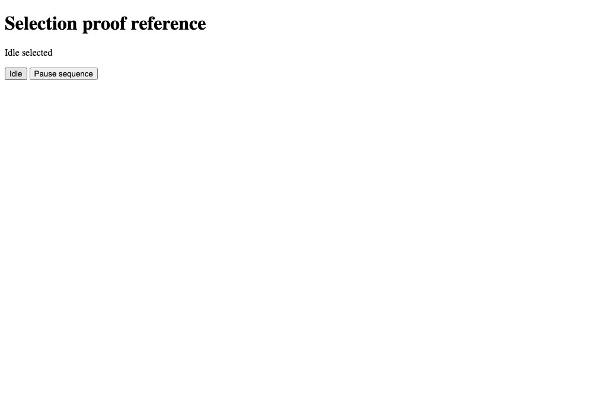

# Retained e2e proof

Verified on 2026-10-02, macOS arm64, Bun 1.4.0, e2e 0.15.1, @e2e-dev/web 0.11.1 and Playwright 1.63.0 Chromium. Runtime reference revision `398d090f4be9243bf01b978b9d6cce069ff05a79` was clean. Source/config/test/fixture/lock digest was `88e9e6db62f2db382f3a4373e72d87a9cb0bfa42aae5c68177c5ad0d8149dc47`. Subsequent changes only retain this evidence and replace repository-relative example links with portable GitHub links; the reference input digest is unchanged.

| Case | Outcome | Observation |
| --- | --- | --- |
| A1 | Pass | Exact repro failed in `tests/selection.ts:8` with `ASSERTION_FAILED` on defective variant, then passed unchanged in the retained regression on fixed variant |
| A2 | Pass | Fresh-directory `--last-failed` rerun reproduced the assertion and preserved every original evidence digest. Invalid-target rerun wrote no new report and retained its selection seed separately |
| A3 | Pass | Wrong run header failed in `beforeEach`, classified inconclusive and refused as confirmation. Policy tests also reject locator/setup/budget, secondary-error, missing/malformed and unknown-version reports |
| A4 | Pass | Sanitized recorded green exploration with a failed step stayed inconclusive; synthetic timeout and issue variants could not satisfy acceptance |
| A5 | Pass | 20 report-policy tests passed, including actual `flaky` status interpretation, preserved retry failures, skipped reason and empty selection |
| A6 | Pass | Site's 61 routing examples match the evals; portable plugin/schema checks, three plugin tests, skill validation, actionlint and diff checks passed. Full diff reviewed for consistent defaults and proof boundaries |

The anonymous fixture uses disposable UI state. Before/rerun/after/wrong-instance targets were `http://127.0.0.1:59933`, `http://127.0.0.1:59939`, `http://127.0.0.1:59946`, `http://127.0.0.1:59953`. All real reference reports record zero model tokens. No model/provider login was used. The reference owns and disposes each ephemeral server/browser.

Raw [before report](evidence/before/report.json), [rerun report](evidence/rerun/report.json), [after report](evidence/after/report.json), [wrong-instance report](evidence/wrong-instance/report.json), and [startup-failure identity](evidence/startup-failure/identity.json) remain intact. The startup failure's [selection report](evidence/startup-failure/selection-report.json) is prior evidence, not a new observation. [Verification summary](evidence/verification.json) records lineage and every original artifact digest. Its original absolute paths name the local runs; the committed copies here support durable review. Selected screenshots and failure screen logs are retained under the matching artifact paths. Trace archives remain in ignored local runs and short-lived CI artifacts; they are not needed for these assertion claims.

First failure report SHA256 `9d27c91b26ab0b3a67132e782a7507bd49afadc41476a20df4d0061a5fb56353` remained unchanged after both reruns. The failure's screenshot shows Pause sequence after choosing Idle; the fixed screenshot shows Play sequence.

The [recorded exploration fixture](../../examples/e2e-proof/fixtures/README.md) is evidence of report interpretation, not live model quality. Current live exploration, authenticated persistence, native mobile and restarted Codex host configuration loading were not run. They need separate product trials. Pencil/Storybook were skipped because an unstyled interaction fixture and report outputs establish these cases; no visual design decision or animation claim is made.

The initial sandboxed browser launch failed with `ENGINE_FAILURE`; it was not counted as a defect or successful proof. Chromium checks then ran with approved local browser permissions. Dependency resolution used a temporary package-name exception for the two pinned Tester Army packages already exercised by Loami, leaving the global seven-day age policy intact. The temporary config was removed, and a frozen install passed from the committed lockfile.
