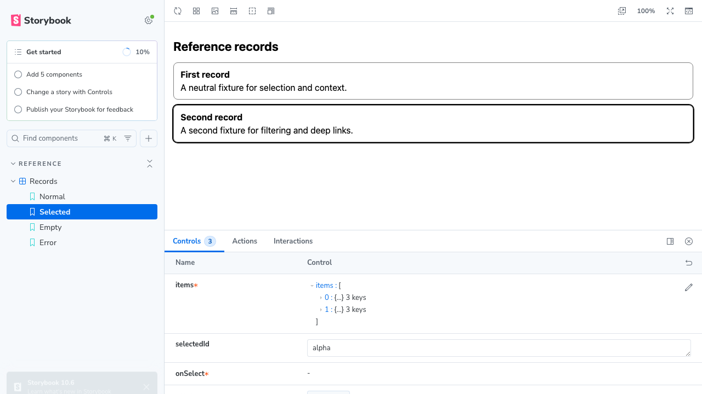

# Example repairs in PR 15

The existing foundation PR now includes the ChatGPT example Storybook repair and clearer e2e verification output previously separated into PR 16. All example source changes were copied byte-for-byte from `3397f896ab1dafd806a6de0e3dab901542825ed2`, then verified in `foundation-reference`.

| Observation | Result | Selected evidence |
| --- | --- | --- |
| Original blank Storybook canvas | failure retained | [Original report](delivered/storybook/original-failure.json), [image](delivered/storybook/original-failure.png) |
| Cold install, full Storybook manager | main reproduces React import error; PR 15 renders all four stories and selection works | [Manager observations](delivered/storybook/manager.json), [before](delivered/storybook/main-normal.png), [after selection](delivered/storybook/pr15-selected.png) |
| Development and built Storybook | four stories and selection pass, no browser errors, cleanup completes | [Development report](delivered/storybook/dev.json), [built report](delivered/storybook/built.json) |
| E2e verification | default and verbose modes pass A1–A4; expected teaching failures remain visible in raw reports | [Default console](delivered/e2e/default-console.log), [verification](delivered/e2e/verification.json) |
| Unexpected browser setup failure | nonzero exit with diagnostic paths | [Control result](delivered/e2e/setup-control.json), [console](delivered/e2e/setup-control.log) |

On macOS, Bun 1.4.0, Node 24 and Chromium, plugin build/typecheck and 15 tests pass; e2e typecheck and 20 policy tests pass. Root site/plugin checks, six scaffold/package tests and built portable-artifact validation pass. These observations establish local component and verification behavior. They do not establish installed ChatGPT behavior or change the foundation's WorkOS proof tiers. Storybook's internal `PopoverProvider` warning occurs in both the broken and repaired manager; it does not prevent rendering.

Reports retain the actual precommit revision `f6c74c11a9be87f92f129efaa4a96c2962c7bbca` and dirty state. [Source inputs](delivered/source-inputs.json) identify the observed browser and e2e bytes and map 17 media observations to 12 byte-exact images. The Storybook digest is `984e116d434e03114c1bdca28fdd04dded7d4a258b74462206bc16595167113e`; the e2e digest is `fd0339cc25c1003ec184c415b3eaf24492f8bb3efcfae2dca251d03b200127d0`. Main's reproduced configuration was also the unchanged PR 15 configuration before this repair. Original reports were not relabelled as postcommit observations.

This folder retains 25 selected files instead of PR 16's 68 evidence files. [Retention metadata](retention.json) records hashes and sanitization. Full rerun trees, JUnit output, empty logs and verbose output stay in ignored `.proof`/`.e2e` folders and CI artifacts. The [original PR 16 archive](https://github.com/applification/astack/tree/3397f896ab1dafd806a6de0e3dab901542825ed2/.astack/example-startup) remains available, including its inconclusive empty-cache control and successful invalid-cache control; consolidation does not rewrite that history. The [proof guidance](../../plugins/applification/skills/astack/references/proof.md#keep-review-evidence-proportional) now requires selected durable review evidence.

Review confirms that the fix prebundles React's CommonJS roots without changing the component or MCP profiles. The e2e change retains the original assertions and exit semantics while labelling expected controls and keeping unexpected failures nonzero. The existing foundation Convex review remains applicable: this follow-up changes no Convex or authentication code.
