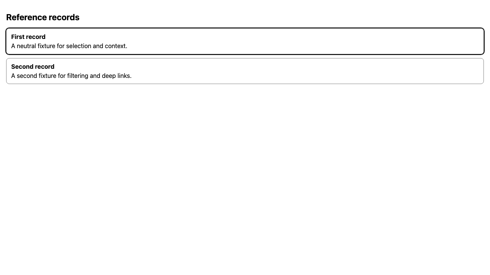

# Example startup repairs — 5 October 2026

`examples/chatgpt-plugin` built successfully but its development Storybook canvas stayed blank. The original browser repro at base commit `f29f52dc5ee5b73feb1b24d301cb61f1a578549f` observed React's CommonJS entry reaching the browser directly and throwing “does not provide an export named default”; [the first failure](first-failure/storybook.json) and its blank canvas image remain intact. Explicitly including the React and React DOM roots in Vite dependency prebundling fixes this development path without changing the component or MCP profiles.

The added browser verifier starts its own development or built Storybook on an ephemeral loopback port, checks normal/selected/empty/error rendering, changes selection through the story's actual `useArgs` callback and fails on browser runtime errors. Both [development](storybook/dev/delivered/report.json) and [built](storybook/built/delivered/report.json) checks pass all four stories with no errors and complete cleanup. The root agent visually inspected the retained normal, selected, empty and error states. CI now runs both browser modes; building alone missed the reported defect. The observed input digest is `984e116d434e03114c1bdca28fdd04dded7d4a258b74462206bc16595167113e`, on base commit plus recorded working source. [Reviewed inputs](reviewed-inputs.json) preserve hashes for the browser inputs and changed verification scripts/workflow.

The owner's pasted `e2e-proof` output ended with A1–A4 passing. Its assertion failures, invalid target and wrong-instance failures are deliberate controls; the [baseline console](e2e/delivered/before-console.log) reproduced the confusing output. `verify` now prints five labelled checks and a clear final verdict. Full runner stdout/stderr remain beside the raw reports; `--verbose` streams them. Original report-policy assertions, negative controls, fixed-app regression and exit semantics remain intact.

The [default console](e2e/delivered/final-console.log) and [verification summary](e2e/delivered/final-verification.json) pass A1–A4, including unchanged first-failure digests after reruns. [Verbose output](e2e/delivered/verbose-console.log) retains the original detailed diagnostics and also passes. A deliberately invalid browser-cache path produces [nonzero verification failure](e2e/delivered/unexpected-setup-result.json) and [diagnostic paths](e2e/delivered/unexpected-setup-console.log), demonstrating that quiet output does not hide unexpected setup failures. An earlier empty-cache control was [inconclusive](e2e/delivered/inconclusive-negative-control.json): the framework installed Chromium automatically, so unavailability was never induced. That owned download directory was removed.

Local validation passed ChatGPT plugin typechecking/build, all 15 protocol/adapter/relocation tests, both Storybook browser modes, e2e typechecking and all 20 report-policy tests, default and verbose browser proof, three root package-validator tests, site/plugin validation and validation of the built portable artifact. All runtime checks used Bun 1.4.0, Node 24 and local Chromium. These repairs establish local Storybook and verification behavior; they make no installed ChatGPT or external identity claim. The seeded test failures remain expected teaching observations.

Each retained evidence folder has original/retained file digests and transformations. Terminal controls and credentials are sanitized; PNGs are byte-exact. Trace archives are omitted with hashes/reasons because their contents are not sanitized. The source revision and source digest in each original report are preserved rather than relabelled as a later commit. No release or merge was performed.
