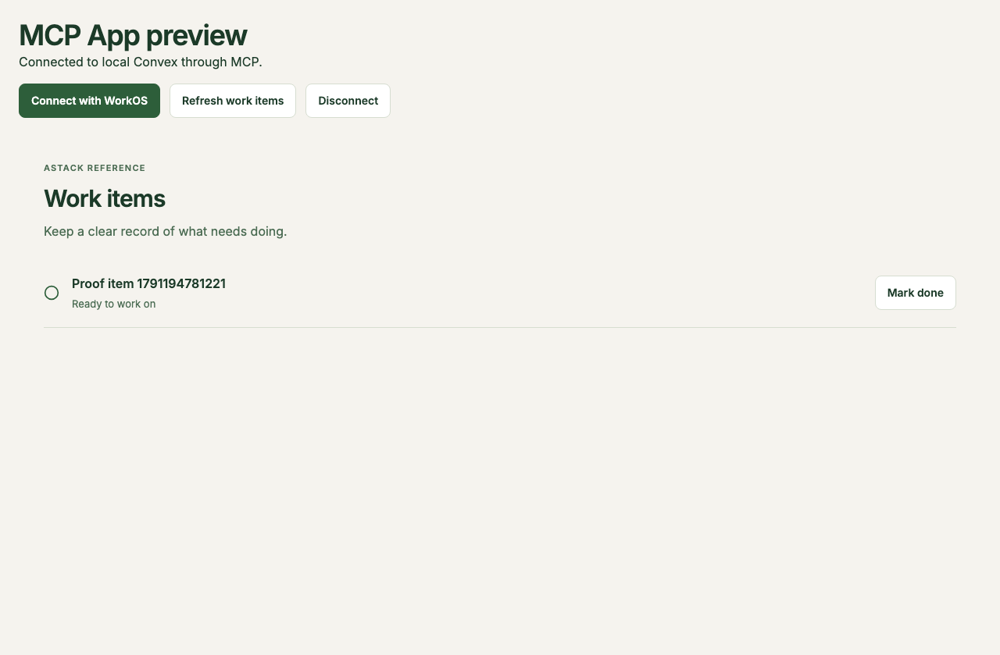

# First-run setup and standalone MCP preview

The owner reproduced three gaps on 5 October 2026: Convex requested AI-file setup, web gave an unexplained `.env.example` instruction, and the bare MCP App at port 5174 self-initialized without a host (`-32601`) then waited indefinitely.

Startup now installs Convex AI files idempotently, saves/applies public WorkOS configuration through `setup:workos` and guarded local startup, and serves a development AppBridge host at port 5174. The web setup state names the configuration and one-time command. The preview uses WorkOS discovery/DCR/PKCE/state and the actual MCP HTML/tool endpoint; production resources contain no development host. WorkOS resources may use HTTP only at the exact local Convex loopback `/mcp` origin. Existing signatures, expiry, exact MCP audience, cross-owner denial and cloud-target guards remain required.

The accepted local build is `5349fcd9da018d80d04134358a0e0627fcb49d90@sha256-dadbad2ab43839dfb5b918122154261b760445936c69ef4337cda0271537ceff` (base commit plus recorded working source), checked against retained source before packaging. The [identity](identity.json), [readiness report](readiness/delivered/report.json), [redacted log](readiness/delivered/runtime.log), and [source archive](source.zip) preserve observations, source hashes and sanitization/omission metadata. Native Pen content is omitted with its original hash and reason; it is never parsed or redacted as text. Historical trial scores/archives remain unchanged.

R1–R9 passed and cleanup completed in isolated local Convex/Vite/Chromium. R9 observed an ordinary preview page without protocol/runtime errors, rejected a mismatched callback and foreign proxy origin, loaded the actual MCP resource with a signed test identity, changed status, confirmed it through a fresh authenticated backend read, refreshed and disconnected. This is host/transport/persistence proof with local test credentials. It is not WorkOS login or installed ChatGPT proof.

The deterministic gate passed 39 tests, typed lint/types and all browser/Storybook builds in fresh Linux CI at `57faa35`. Root plugin/site validation covered 72 routing examples; all three scaffold regressions passed. The scoped Convex reviewer skill found no remaining actionable issue in this diff; see [review](../convex-review.md). The startup verifier now also checks automatic AI setup and both first-run browser entry points without disturbing the owner's running deployment.

Fresh-run failures remain in [failures](failures/). The initial `ba89698` run failed typed lint at the design browser's inferred SDK page boundary; the unchanged `516cccd` run passed that gate, so its cause is not claimed as established. The page now has an explicit SDK type. The `516cccd` startup then installed AI files successfully but rejected them because a reused BunFile instance cached their missing-file state. `57faa35` replaces that check with fresh filesystem access and passes the new regression and actual first installation. Its [restart report](failures/57faa35-restart-report.json) confirms both first-run surfaces, automatic AI setup and data/configuration preservation, but fails export after premature readiness detected a temporary administrative backend. The verifier now waits for the new development session's successful function push as well as its health identity.

[Fresh Linux CI](https://github.com/applification/astack/actions/runs/37295671690) passed the complete workflow at source commit `254c719ed6f07e25df8eef656bb7f174a75ea381` and Actions merge checkout `5d7ae96d8bf50ca0928d86cd5fa81e20eda121fa`. Its actual generated build is `unversioned@sha256-a4077030b137e23c7233861457d148245c9b867ba270a698d43523d5dabba6d0`. The [source identity](fresh-ci/source-identity.json) records an official scaffold whose metadata uses that verified checkout; its full source digest matched all original CI reports before retention. The [source archive](fresh-ci/source.zip) embeds original/retained hashes, transformations and opaque Pen omission metadata. This generated-source identity is separate from the earlier working-reference build above.

The [startup report](fresh-ci/development/delivered/report.json) passes automatic AI setup, first-run browser states, persistent data/configuration after restart and private export; cleanup completed and the export itself was not retained. [Readiness](fresh-ci/readiness/delivered/report.json) passes R1–R9 with G1/G2 explicitly skipped. [Design proof](fresh-ci/design/delivered/report.json) passes all nine states; the root agent inspected all nine retained images and the first-run/preview images. [Enforcement](fresh-ci/enforcement/delivered/report.json) and the [sanitized CI transcript](fresh-ci/checks/delivered/ci.log) retain the fresh gates, including 39 tests. Each evidence folder includes byte provenance and sanitization records. The later evidence commit changes no profile source.

The [sandbox record](../workos-sandbox.md) identifies the real WorkOS configuration and exact local resource. Actual web and preview browser actions reached its [web sign-in](workos/web-authorize.png) and [MCP sign-in](workos/mcp-authorize.png) surfaces without uncaught errors. The smoke-created DCR client was deleted after the check. Completed login/consent, same-user continuity, token refresh and installed-host observations remain pending owner sign-in; no authenticated provider success is claimed. No cloud deployment or data transfer occurred.
