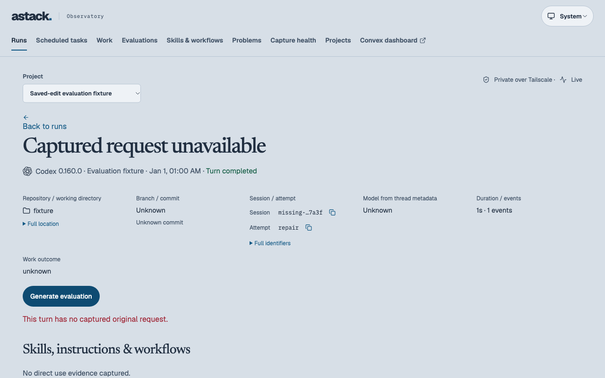

# Captured request verification

Observed on 7 October 2026, macOS arm64, Bun 1.4.0, TypeScript 6.0.2 and Convex 1.46.0. Checks ran on the changed tree based on `4940ee274a7bbc2366f53294889a1548b5388701`; [source hashes](source-hashes.json) pin the changed source and tests. The [failing baseline](baseline.log) ran against `312b018e830268dfeb2d8d7a2ea87c67e7deea00`; [browser result summaries](browser-results.json) retain the final test identities and outcomes.

| Contract | Observed result |
| --- | --- |
| A1: full request, one stored copy | Native mutation tests preserve 5,633 and 16,000 characters. The browser generates and reloads a 5,633-character request. A separate owner API read confirms exact capture equality, reference metadata, a reference criterion and one evaluation after retry. |
| A2: compatibility and boundaries | Existing manifest, saved-edit assessment and proof variants pass. Captured source revision, enrolled project/machine, owner identity and readable capture checks pass. Concurrent generation returns the same evaluation. A later prompt update does not change its saved request snapshot. |
| A3: limits and failures | Oversized clarification records and a multi-byte request snapshot return their 128 KiB / 512 KiB application errors and save no partial generation. Real browser missing-request generation displays its specific error and keeps retry available; a fresh API read finds no evaluation. |

| Check | Result |
| --- | --- |
| `bun run observatory:check` | Strict types pass; 128 tests pass, 0 fail, 743 assertions across 21 files. |
| `bun run observatory:lint` | Pass; affected UI and stories satisfy the project lint rules. |
| `bun run check` | Pass; site routes, 112 evaluation examples and plugin assets remain valid. |
| `bun run observatory:build` | Production bundle builds. |
| `bun run observatory:build:storybook` | Builds; existing bundle-size warning remains. |
| `bun run observatory:test:e2e` | 47 browser component tests pass, including full-request rendering, narrow viewport overflow and application-error retry. |
| `verify-evaluations-local.ts` and `verify-evaluation-generation-local.ts` | Pass against the owned anonymous Convex backend on ports 3210/3211; collector HTTP delivery, fresh authenticated reads, anonymous denial and existing-agent fallback verified. |
| Local browser suite, `e2e.evaluations-local.config.ts` | 5/5 pass against the actual React/Convex adapter on port 7410. |
| Fresh post-browser owner API read | [Recorded result](post-browser-read.json): exact 5,633-character request, one saved evaluation, no copied metadata request, no saved evaluation for missing capture; proof stays null. |

The local browser suite first exposed an ambiguous heading locator, which was fixed by selecting the page heading. A subsequent run reused old assessment fixtures and hit an ambiguous historical feedback locator. Both fixture scripts were rerun to create fresh state before the full passing suite. These setup failures are retained here; they were not product failures or retry passes. The final runner reports contain zero flaky tests.

## Convex review

Applied `applification:convex` and the completed-diff `convex:convex-reviewer` checklist. The existing public mutation still accepts only a run/project identity, checks the configured owner before access, verifies project enrollment and current capture policy, uses indexed bounded reads, and writes snapshots and run links in one transaction. Arguments and returns retain validators; generation idempotency remains indexed and transaction-safe. The internal ingest helper validates machine/project/source identity and now requires every selected turn for captured intent to be readable. Captured revision mismatches are rejected at collector and backend boundaries. Byte budgets remain below the Convex document limit. No new action, model call, table or index is needed.

The review found one missing readable-capture check for imported captured references. It was fixed on both collector and backend boundaries, with negative regressions. No unresolved finding remains within this change. The additive persisted form preserves old declared manifests and requires backend-first rollout before new collector/UI writers.

## Retained media and gaps

This screenshot uses synthetic local fixtures and shows the precise application error in the existing run-detail layout. Full request persistence is established by exact browser assertions and the independent backend read, rather than a screenshot of repetitive text. Pen was skipped because the layout is unchanged; Storybook covers the long-content and error states. No recording was needed for these static states.

Otis has not been deployed or retested with this change. Its observed 5,633-character failure is reproduced by synthetic regression data; the private Loami request is excluded from committed evidence. Roll out the backend before the updated collector and UI.
