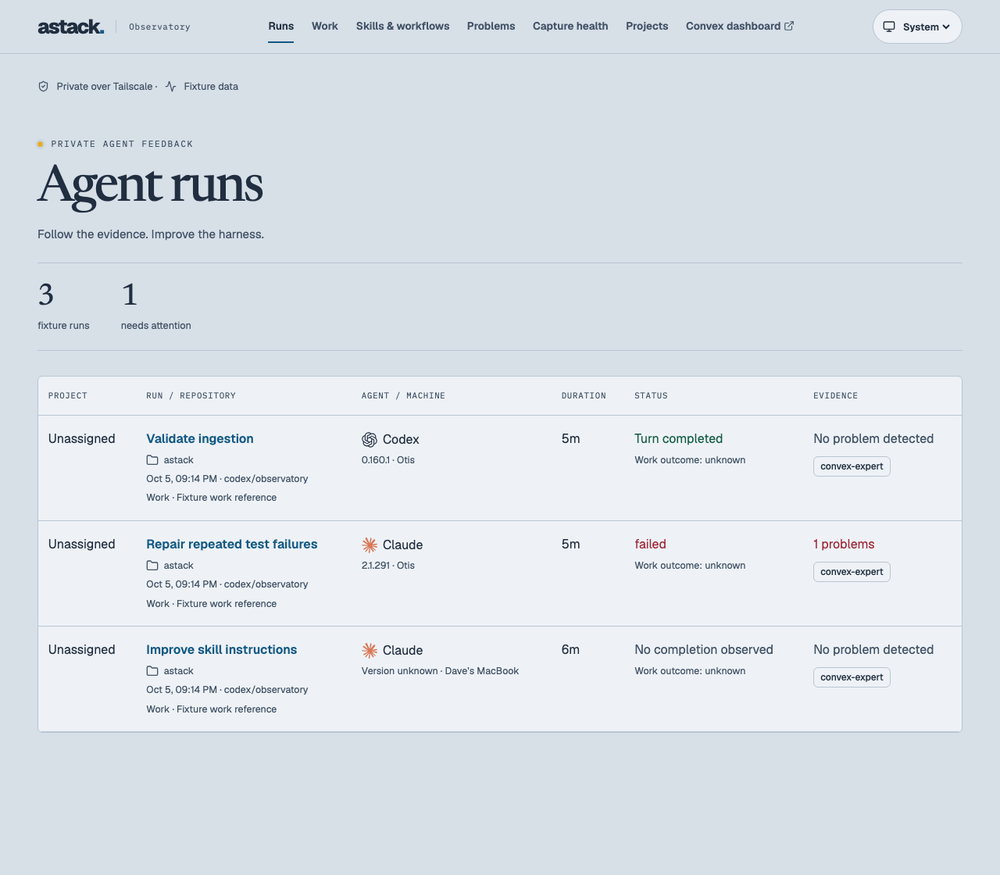
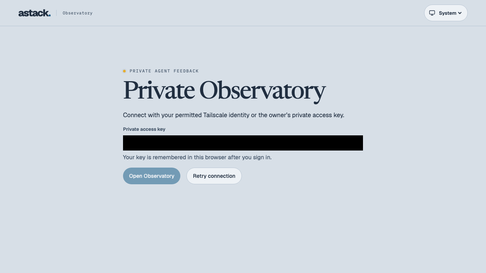

# Remembered login and Claude CLI versions

Owner request: show the Claude **CLI** version alongside Codex and remember the personal access key through refreshes and deployments. This explicitly supersedes the earlier preference-only localStorage policy in the [Observatory contract](../agent-observatory/behavior-contract.md).

Implementation and proof: the commit introducing this document, based on `6e50980`, on Otis/macOS arm64 with Bun 1.4.0. No production assets, collector installation or live telemetry were changed by this task.

- **Remembered login — pass:** the real authentication hook and production login form run in Strict Mode against a synthetic session endpoint. Successful login stores the trimmed owner key, reload sends it to obtain a fresh session, and the JWT is absent from localStorage. Rejected saved keys are removed and can be replaced; a temporary outage retains the key, and restricted storage permits an in-memory session.
- **CLI provenance — pass:** native version lookup requires a strong T3 Claude session identity, matching working directory and user/assistant records in that provider turn's time interval. Resumed sessions across upgrades retain the appropriate version per turn; conflicting records clear a prior version. Missing logs, malformed/model values, weak identities, symlink escapes and files over 32 MiB stay unknown. Native message content is not imported.
- **Replay and integration — pass:** the previous checkpoint format replays once, then remains stable. Enrichment preserves the original run and event IDs, and a captured version survives later log removal. Complete collector capture and native Convex ingestion return the CLI version in a fresh owner query and version filter choices; native Codex remains available through a T3 outage. The signed portable binary passes the same collector integration.
- **Installed source — pass:** a read-only authenticated T3 projection plus its matching native transcript normalizes the reported Claude turn to version `2.1.291` with 11 events. The isolated probe queued zero records. This establishes source compatibility; deployment and the updated production login journey remain pending rollout.

Observed checks: strict types and the full domain/backend suite passed **71 tests**; the final focused collector/version suite passed **17 tests / 113 assertions**. UI lint, production UI build, Storybook build and site/plugin checks passed. The signed portable route passed **14 tests / 105 assertions**. The browser suite passed **18 tests**, with a final single-test capture confirming the full version table. Raw reports remain ignored under `.proof/claude-cli` and `.e2e`.

One intermediate test used a forbidden direct password-value assertion (`POLICY_DENIED`). It was corrected to assert that the retry button remains enabled after a rejection, without reading the password. This was a test-API error; no product failure or flaky test remains. Initial checks required installing the frozen dependencies. The collaborative browser could not reach the local fixture server; the project's existing e2e runner supplied the retained screenshots instead.

Pen was skipped because this preserves the existing layout and adds one explanatory login sentence. Storybook was selected to check the real form/hook lifecycle and known/unknown version rows. Both retained images contain synthetic data; the runner masks the password input even when empty.

The implementing agent applied the installed Convex reviewer checklist to the completed client diff and existing session/ownership consumers. No unresolved findings: the server verifies the owner key and issues short-lived JWTs; native Convex authentication and per-operation owner checks remain authoritative. No schema, public function, validator, index or query changed. This was self-review, not independent review.

Rollout requires the frontend and updated collector. Its checkpoint revision handles existing T3 history without new run IDs. The optional `claudeHome` setting supports the native transcript directory; additional per-provider custom homes and standalone Claude trace capture are outside this change. The [operator documentation](../../docs/agent-observatory.md) describes persistence and provenance limits.
