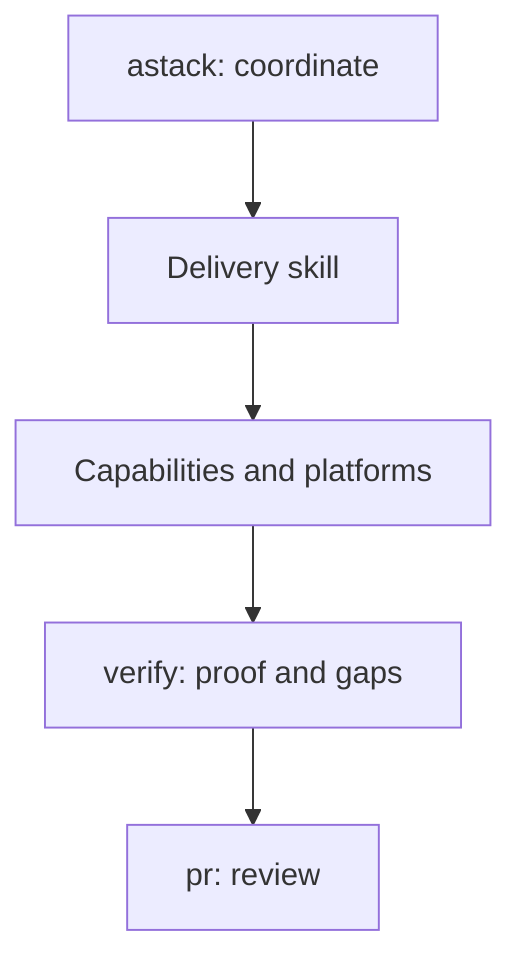

# PR destination inspection

On 5 October 2026 the posted [PR 18](https://github.com/applification/astack/pull/18) title, catalog table, evidence links and composition view were read back in GitHub. The first new diagram used long single-line labels; the rendered view clipped their ends in the narrow PR column. Shorter labels corrected the failure. A second screenshot showed the complete five-node vertical view with readable labels:

Adjacent prose limits this view to kept implementation changes, describes direct skills returning their own result and bounded contributions returning to the caller, and distinguishes the illustration from execution proof. The actual table lists all 16 skill identities. The destination inspection observed structure/readability, not runtime platform behavior. No browser merge or external message was sent.

The iteration plan's PR 18 block was updated and read back at sequence 30 with the corrected architecture, focused installed-candidate trial evidence, remaining foundation gaps and PR 17 reconciliation milestone. The temporary site browser tab and owned local server were closed after inspection; the PR tab remains available for review.
