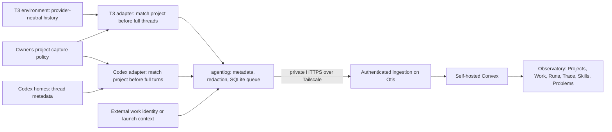

# Agent Observatory

Agent Observatory is Astack’s private feedback system for coding-agent behavior. It captures native Codex desktop/CLI turns and, when configured, provider turns recorded by T3 Code, including Claude and Codex. It observes enrolled projects, groups runs by project and optional external work references, and shows traces and skill-version correlations. It lives in this repository. There is no COS work store or agent dispatcher in Astack today; Observatory does not create either.



## Use on Otis

The **Convex admin dashboard** is at [https://otis.tail12a0a0.ts.net:8453](https://otis.tail12a0a0.ts.net:8453), or [http://127.0.0.1:6792](http://127.0.0.1:6792) directly on Otis. Observatory's top navigation includes **Convex dashboard**, which opens it in a new tab. It connects to the same persistent backend used by Observatory. Keep the pre-filled deployment URL and log in with the existing `CONVEX_SELF_HOSTED_ADMIN_KEY` from the permission-restricted `~/.local/share/astack/observatory/deployment.env`. This is separate from the Observatory viewer key. To copy the admin key without printing it:

```sh
bun --env-file "$HOME/.local/share/astack/observatory/deployment.env" -e 'const key = process.env.CONVEX_SELF_HOSTED_ADMIN_KEY; if (!key) throw new Error("Missing admin credential"); const child = Bun.spawn(["pbcopy"], { stdin: "pipe" }); child.stdin.write(key); child.stdin.end(); await child.exited;'
```

The dashboard is an official pinned Convex container, bound to loopback and exposed privately by Tailscale Serve. It starts with the existing deployment at login. Convex's `dashboard` CLI command does not support this self-hosted deployment; use the link above. See the [official self-hosting guide](https://github.com/get-convex/convex-backend/blob/main/self-hosted/README.md).

Open **https://otis.tail12a0a0.ts.net:8450** while connected to Tailscale. A permitted Tailscale identity can obtain a short-lived native Convex JWT. Same-host requests do not receive Tailscale identity headers; use the separate owner access key in that case:

```sh
pbcopy < "$HOME/.local/share/astack/observatory/viewer-access-key"
```

Paste it into the private access form. After successful sign-in, the UI remembers the owner access key in this browser's localStorage and reuses it after refreshes and deployments on the same origin. A rejected saved key is cleared; temporary service outages keep it for retry. Short-lived Convex JWTs stay in memory. Clearing site data removes the remembered key. The machine ingestion key cannot open the UI or query telemetry.

The header's **Color theme** control offers System, Light and Dark on both the access screen and authenticated views. System follows your OS appearance; explicit choices persist across reloads. Typography and colors follow the public Astack site; fonts are bundled with the private UI and require no third-party font requests.

The trace omits a time when its source did not record one, with one explanation above the events. Available agent times and hook observation times remain labelled; recorded order is unchanged. Collector observation time is available in expanded details and is not presented as the event time.

The trace's **Show content** toggle defaults on. Expand events to read captured messages, commands and tool arguments/results. Uncheck it to hide that content, including previews; timing, failures and skill evidence remain visible. Your choice survives reloads. Theme, content visibility and the remembered owner access key are stored in localStorage; conversation content and Convex JWTs are not. Hiding details does not stop capture or erase privately stored content.

New collectors capture readable content with mandatory secret redaction. An existing `captureContent: false` setting stays metadata-only until explicitly enabled. To change a machine's collection mode, run `agentlog content on` or `agentlog content off` and restart its collector. Changing modes re-reads available configured source history using the same event identities. History that a source no longer retains cannot be reconstructed, and stopping capture does not guarantee deletion of older records whose source has disappeared. Large content remains bounded by the record limits. Hidden reasoning is never collected.

The collector always redacts its ingestion key and known environment secrets. Add paths to single-credential files in `secretFiles` in the private collector config for additional known-secret matching; Otis includes the owner's viewer-key file. These values are read privately before capture and never included in telemetry. Structured credentials, environment assignments and common token formats are also redacted in either capture mode.

Otis is already installed. The runtime is at `~/.local/share/astack/observatory`, the collector state at `~/.agentlog`, and two user LaunchAgents supervise capture and start the Docker deployment at login. The permanent runtime is independent of a disposable Codex worktree. Convex uses a named Docker volume and pinned backend/nginx/dashboard images. Docker ports bind to loopback; Tailscale Serve exposes HTTPS ports 8450–8453 privately. Existing Serve routes are preserved; no Funnel is configured.

```sh
"$HOME/.local/share/astack/observatory/bin/agentlog" status
docker compose --project-directory "$HOME/.local/share/astack/observatory" ps
```

The status command reports queued records, project-policy health, source health and forwarding health. A stopped backend does not stop the coding agent: the independent collector retains its eligible SQLite queue and retries with backoff. Restarting the collector preserves identity, checkpoints, signatures and undelivered revisions.

## Optional multi-provider T3 capture

Claude run versions come from native `user`/`assistant` records in the matching T3 session's local transcript during that provider turn. The collector reads only this version metadata; it does not import native conversation content. It uses `claudeHome` in the collector config, defaulting to `CLAUDE_CONFIG_DIR` or `~/.claude`. Missing logs, weak session identities, conflicting versions and files above the 32 MiB limit remain unknown. Upgrading this collector replays unchanged T3 threads once to enrich existing run IDs. The installed CLI's current version is never substituted for a historical run.

Native Codex homes remain configured independently. To also observe T3's recorded Claude, Codex and other provider turns, install the updated agentlog binary and add a T3 source on the computer hosting that T3 environment and its workspaces. No provider settings or launch paths need to change. This adapter does not collect standalone Claude sessions launched outside T3.

Create an owner-issued T3 pairing grant that includes `orchestration:read`, and save the pairing value in a private file with mode `0600`. Stop the collector while changing configuration, then run:

```sh
agentlog t3-configure \
  --url http://127.0.0.1:3773 \
  --label "T3 Otis" \
  --pairing-file "$HOME/.agentlog/t3-pairing.token"
```

Use your T3 server's actual origin; loopback HTTP and private Tailscale HTTPS are supported. The command exchanges the grant for bearer access scoped only to `orchestration:read`, validates active and archived reads, and stores the bearer in a restricted `t3-ENVIRONMENT_ID.token` file. Remove the temporary pairing file after successful setup. An existing bearer can instead be supplied with `--token-file /absolute/private/file`. Never pass a credential value in command arguments or put it in the repository.

The source is appended to `t3Sources` in the existing private config, retaining native homes, machine identity, ingestion credential, capture settings and native checkpoints. Restart the collector using its existing supervision and inspect `agentlog status`: `t3` lists each environment's health separately from `homes`. An expired/revoked credential, incompatible protocol or unreachable T3 server reports a capture error and leaves native capture running. Renew the grant and rerun setup when access expires. The saved environment UUID is checked before any bearer credential is sent on later polls.

The adapter includes active and archived threads, checks project enrollment before fetching full history, and retrieves omitted tool output through T3's full-item read. Local Git identity takes precedence; if a worktree has been removed, reported T3 project identity can still match its repository. A fork's reported origin stays distinct from upstream, and the source of repository evidence is labelled in run coverage. One Observatory run represents one provider turn, since a T3 run can include several turns. T3's own run/thread/turn identities remain in the start event. Codex uses the same canonical native session/turn identity in both adapters: the first collector owns its events, preserving existing history and preventing double counts. Native capture is polled first; a later source cannot enrich a turn already owned by the other source. Weak or missing native Codex references are deferred and retried, with `partial` health and a deferred-turn count.

Shared message, command, tool, file-change, error, interruption and subagent records translate across T3 providers. Provider-specific observations vary; unsupported items are counted in run coverage. Claude `Read` and `Skill` tools can provide direct capability evidence. Automatically supplied instructions and hidden reasoning are not inferred or stored. T3-recorded timestamps are labelled as agent-surfaced observations; completion still leaves engineering outcome unknown. Each response is bounded to 32 MiB; larger histories report `t3_response_budget` and require a future paginated adapter rather than silently losing records. T3 protocol-v2 fixtures and the installed schema were checked; authenticated installed-host Claude capture remains pending an owner read grant. See [T3 evidence](../.astack/agent-observatory/t3-evidence.md).

## Enroll and select projects

Open [Projects](https://otis.tail12a0a0.ts.net:8450/#projects), enter a name and one or more repository URLs, and save. SSH and HTTPS URLs for the same repository share an identity, so clones and worktrees on either computer match automatically. Codex's recorded origin takes precedence. When it is absent, the collector reads local Git configuration, following linked worktrees to their shared repository. New worktrees need no individual folder registration. A repository can belong to one project. For non-Git projects or unavailable repository identity, add an absolute project folder on its registered computer. Folder matching includes subfolders and respects path boundaries. Conflicting project matches are excluded rather than guessed.

The **Project** selector scopes Runs, Work, Skills, Problems and their drill-downs. **All enrolled projects** combines registered history. Work references with the same ID in different projects remain separate. Project names are editable; **Pause capture** stops future uploads for that project while preserving its existing history. Astack is enrolled on Otis with its repository and known checkout folders. Additional projects require owner enrollment.

The collector fetches the owner's policy before reading full turns, and ingestion independently checks membership again. An offline collector uses its last accepted policy; a new machine without a policy captures no turns. Pausing takes effect at the backend immediately, and at an offline collector when it reconnects. Machine credentials can read only repository definitions and folders for their own computer, not telemetry or other computers' folders. The Health page describes computer-wide operations, while project reports remain scoped.

Local Git lookup requires Git and an available checkout. It reads repository/worktree configuration with a one-second deadline and an 8 KiB output limit; inherited Git overrides, global/system settings and configuration includes are ignored. Credentials are removed before the recovered identity leaves the lookup. Runs label this as a capture-time local observation; no historical origin, branch or commit is invented. A removed checkout with no recorded origin still cannot be identified through this fallback. Explicit folder matches remain available when Git lookup fails.

Saving a project schedules a bounded pass over retained backend history, and its next collector refresh replays available matching source history. Only confident repository/folder matches are assigned. Existing unmatched or ambiguous history stays stored outside reports and is excluded from forwarding; no source files or previously retained records are deleted. Project registration is bounded to 100 projects and 16 KiB of configuration per project.

## What the data means

| Concept              | Meaning in v1                                                                                                                                                                         |
| -------------------- | ------------------------------------------------------------------------------------------------------------------------------------------------------------------------------------- |
| Project              | Owner-enrolled grouping and capture boundary across machines, clones and worktrees.                                                                                                   |
| Run                  | An execution attempt; one native Codex or T3 provider turn. Session and available parent-session identities remain available.                                                         |
| Completion           | The agent turn ended. Engineering outcome remains `unknown` until explicitly supplied.                                                                                                |
| Trace                | Recorded item order, augmented by separately labelled hook observations. Native Codex persisted items usually have no wall-clock time; T3 can record item times.                      |
| Start / duration     | Native turn time when present. Legacy session-date fallbacks are labelled and have unknown run duration.                                                                              |
| Skill or instruction | Direct read action or explicit skill input. Availability in a catalog is not evidence of use.                                                                                         |
| Skill hash           | File content at first observation, preserved across later polls. A historical run's original version may be unavailable.                                                              |
| Workflow             | Explicitly declared workflow step. Conversation text is not guessed into a workflow.                                                                                                  |
| Problem              | Deterministic evidence of repeated failures, failed turns, or no completion with stale persisted session activity. Interventions and long runs are additional informational findings. |

The Skills view groups by kind, name, hash and provenance. Its counts span the selected project's enrolled runs, or all enrolled projects; drill-down selects that exact group. **Problem rate** is the percentage of that group's runs with at least one warning or error finding. Informational findings are excluded and each run is counted once. Hover, focus or activate a rate to see its numerator, denominator and scope. Activated help stays open until Escape, an outside press or focus leaving the trigger. This reports co-occurrence, not causation or engineering success. Run-list and Work-view totals describe loaded pages.

Runs, Work and Problems start with a compact **Filters** disclosure. Applied filter counts, selections and **Clear filters** remain visible when the panel is closed. They share select menus for repository, work reference, agent, version, machine, branch, status, work outcome, skill/workflow and tool/MCP. Status and outcome offer their supported values; the other menus load distinct values from the selected project's full enrolled history, independently of the current results and date range. Machine and work choices include readable names alongside their exact IDs. **Any** removes that restriction. Dates use calendar controls, and **Clear filters** resets categories and dates. Existing drill-down selections remain visible if their value is no longer available. Empty indexed candidate pages are scanned automatically until a match is found or history is exhausted; **Load more** still loads further results.

## Privacy and coverage

Readable capture includes visible messages, commands and supported tool arguments/results after mandatory redaction. Metadata-only capture withholds these details. Hidden reasoning is always omitted. Tool names, exit status, durations when available, changed/read paths, skill hashes and keyed command signatures remain useful in either mode. Redaction runs again before every durable record write. Record detail and network batches have byte budgets; omission is explicit.

Native capture reads supported app-server methods without resuming or starting turns. It enumerates thread metadata from every source kind and separately includes archived threads. It requests full turns only for enabled, uniquely matched projects. Available matching history is included by default. Additional native Codex homes and optional T3 environments are configured separately. Ephemeral, cloud-only and unpersisted sessions have no recoverable local history. Token usage is not collected. The paginated full-item API is experimental and verified with Codex **0.160.0**; T3 requires orchestration protocol **2**. Inspect source health after upgrading either source.

Capability hashes skip special files, remote/cloud/protected macOS locations and reads exceeding the deadline; their hashes stay unknown. Skill reads exposed only inside an opaque composite tool call may not have direct native read evidence. Hash provenance is visible rather than reconstructed from a current checkout's commit. The system does not infer ignored/late skills without an expected-skill declaration, prove causation from correlations, or compare agents in v1.

## External work and future COS integration

The parent identity belongs to the external work system. It can bind a session without creating a parallel task:

```sh
agentlog link --session SESSION_ID --work AST-142 --project PROJECT_ID --url https://your-work-system.example/work/AST-142
```

Bindings update already-captured runs immediately and apply to later turns. `PROJECT_ID` is the enrolled Observatory project UUID; an external work system's separate project identity can remain in the work reference. Capture policy owns run classification: launch context cannot override an already enrolled project or authorize capture of an unregistered folder. An Astack launcher should call that binding when it receives the session identity. The optional JSON launch wrapper does this automatically from `thread.started`:

```sh
agentlog run --work AST-142 --project PROJECT_ID -- codex exec --json "Your work request"
```

The wrapper forwards stdout and the agent's exit status unchanged. Other launchers can propagate `ASTACK_WORK_ID` and `ASTACK_PROJECT_ID` through trusted hooks. Missing telemetry never changes the child exit status. This is an integration contract for a future COS; there is no existing Astack launch path to retrofit today.

Explicit annotations are local and queued:

```sh
agentlog workflow --session SESSION_ID --turn TURN_ID --name implement --step verify
agentlog outcome --session SESSION_ID --turn TURN_ID --value success
```

## Work and activity headings

Work still groups explicit `(projectId, work.id)` references across conversations;
an activity still represents one captured provider turn. Cached headings make those
identities readable without changing grouping or inferring work success. A supplied
Work label wins over a generated heading, including when its originating run is
outside the loaded page. Source Work IDs and native session/turn IDs remain available. Run lists and detail pages use the same cached activity name. While naming is pending or unavailable, meaningful source titles survive and technical turn titles use readable provider/repository context. Codex and Claude names have bundled provider marks. Repository links show a compact name and host icon; full locations remain revealable and copyable. Session and attempt IDs are independently labelled, shortened, revealable and copyable, with clipboard success reported only after the write completes.

The independent naming worker uses `gpt-6-luna` through the owner's saved **ChatGPT
login in Codex**. It runs `codex exec` with ephemeral sessions, ignored user/project
configuration, disabled host integrations, a read-only sandbox and an empty working
directory. Captured requests go through stdin; final JSON is validated and temporary
files are removed. Capture and delivery never wait for the model. This uses subscription
quota, with no Platform API key, Convex inference action or Vercel gateway involved.
See [Codex authentication](https://learn.chatgpt.com/docs/auth) and
[noninteractive execution](https://learn.chatgpt.com/docs/non-interactive-mode).

The worker batches up to four naming targets in one call. Each activity uses its
first usable, captured user request; Work samples requests from up to four related
turns, including different conversations. Each excerpt is limited to 1,200 characters
and already redacted. Native environment/instruction preambles are excluded. New
targets wait a minute before claiming so nearby requests can contribute. Successful
names remain stable: page loads, replay and collector polling do not call the model.
The initial historical backfill also consumes subscription quota.

Only content-bearing records belonging to currently enabled capture policy can
be sent for naming. Metadata-only, withheld, unavailable or failed inputs retain
their original heading/Work ID. The server rechecks current policy, Work membership
and event revision before accepting a result. Owner JWTs protect both prompts and
names; machine ingestion credentials cannot operate the naming worker. Failures
back off; expired claims recover after a worker stops.

After deploying the backend/UI and updated agentlog binary, configure **one** worker
on the machine whose Codex home is signed in with ChatGPT. Verify that login with
`codex login status` using the selected `CODEX_HOME`, then use the owner's existing
viewer credential file (separate from the ingestion token):

```sh
agentlog names-configure \
  --backend-url https://otis.tail12a0a0.ts.net:8451 \
  --auth-url https://otis.tail12a0a0.ts.net:8452/auth/session \
  --viewer-token-file "$HOME/.local/share/astack/observatory/viewer-access-key" \
  --codex-home "$HOME/.codex"
agentlog names --once --backfill
agentlog names-service --executable "$HOME/.local/share/astack/observatory/bin/agentlog"
```

`names-service` installs a separate `net.applification.astack-agentlog-names`
LaunchAgent and resumes bounded historical backfill. Its config, cursor and logs
live in the private agentlog state directory: `names-config.json`,
`names-backfill.json`, and `names.{err,out}.log`. The collector keeps its existing
service and credential. `--once` processes at most one backfill page and one ready
batch; it can report zero names while newly queued targets are waiting. On Linux,
supervise `agentlog names --backfill` separately using the same user with Codex auth.
To rescan previously skipped history after enabling capture, remove only the naming
cursor file and rerun `names --backfill`; successful names remain cached.

OpenAI's [Sign in with ChatGPT plan-usage preview](https://developers.openai.com/siwc/token-sharing-open-source)
is a future standalone integration option. It requires the app's own registration
and consent flow. The current worker reuses supported Codex authentication and
needs no additional sign-in integration.

## Optional hooks

Automatic persisted capture needs no hooks. For near-use skill hashes, intervention observations and more timing/context, install the optional asynchronous definitions and **review/trust them through Codex `/hooks`**. Native exact-hash trust is never bypassed. SessionEnd is excluded because it is synchronous even when marked async.

```sh
agentlog hooks --executable "$HOME/.local/share/astack/observatory/bin/agentlog" --install
```

Hooks write only local metadata, emit inert `{}` and fail open. An early hook can match an enrolled worktree through local Git before its first native snapshot; without an enabled policy or reliable project match it stores nothing. Async observation times are not exact tool-start timestamps. Hooks are prepared but were not installed or trusted on Otis.

## Development and operations

See [MacBook setup](agent-observatory-macbook.md), [architecture decision](adr/0007-agent-observatory.md), [research](../.astack/agent-observatory/research.md), [contract](../.astack/agent-observatory/behavior-contract.md), [project capture contract](../.astack/agent-observatory/project-capture.md), and [verification](../.astack/agent-observatory/evidence.md).

```sh
bun install --frozen-lockfile
bun run observatory:check
bun run observatory:lint
bun run observatory:build
bun run observatory:build:storybook
bun run observatory:test:e2e
```

`bun infra/observatory/bootstrap.ts` initializes or restores the private Otis configuration without printing credentials. `bun infra/observatory/deploy.ts` copies the UI build, atomically installs the signed collector, and registers supervision. These are Otis-specific operator scripts. The standalone collector installer is portable across machines.

`bun packages/backend/scripts/verify-live.ts` checks actual native auth and stored traces. Set `OBSERVATORY_RESTART_PROOF=1` to include a backend restart/persistence check. `bun run observatory:test:live` exercises the deployed UI using the owner's key file; its private runner outputs stay ignored. Retained public screenshots use synthetic fixtures.

For a changed facet projection, `bun packages/backend/scripts/rebuild-facets.ts` performs bounded internal repairs without changing source records or capability counts. For historical recapture, stop the collector, run `agentlog backfill` (or `--since ISO_DATE`), then reinstall its service. Capture keys and the durable queue are preserved.

For backups use the installed Convex CLI's `convex export --path /private/backup.zip`, and separately protect the runtime configuration/signing files and collector identity/token/SQLite directory. Do not put exports in the public repository. To stop this deployment, boot out its two LaunchAgents, disable only Serve ports 8450–8453, and run `docker compose down` in the runtime directory. Keep the named volume for recovery.
