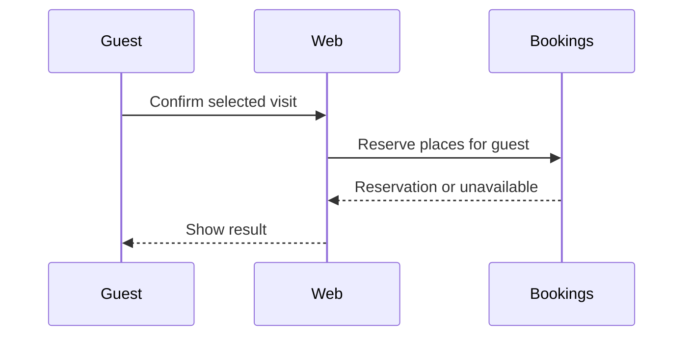

# Show me

Show the point directly. Keep prose brief and put each view beside the short explanation it supports. Use this for a discussion, code walkthrough, design choice or review; a PR is one possible destination. Read the relevant source or supplied material first and choose the smallest view that answers the user's question.

Use judgment: one view is often enough; several can answer distinct questions. Skip a view that merely repeats a simple sentence. Keep real names, relevant ownership and ordering; label proposals and unknowns. Do not invent a missing call, API or observed outcome.

## Show logic

Use pseudocode when conditions or operation order matter. For example, explaining a save path:

```text
on save(draft)
  validate draft
  if draft matches stored version
    return unchanged
  persist draft
  return saved version
```

## Show runtime flow

Use a shallow call tree for the calls that explain the effect:

```text
confirmReservation
  authorizeGuest
  holdPlaces
    checkAvailability
    writeReservation
  sendConfirmation
```

Annotate conditional or concurrent calls. Use a sequence diagram if a tree would hide timing or actor boundaries.

## Show structure and ownership

Use a component tree with the state and module boundaries that matter:

```text
<BookingPage> (apps/web)
  useReservations()          # server-owned records
  <GuestPicker>             # local selection
  <ReservationSummary> (packages/ui)
```

Use a shallow file tree to explain responsibilities:

```text
src/
├── bookings/    # reservation rules
├── storage/     # persistence adapter
└── web/         # request and response boundary
```

## Show interactions or states

Use Mermaid for actor interaction, data flow, lifecycle or control flow:



Give it a short text equivalent. Inspect rendering when tools and the destination support it; if they do not, use a readable text view and name that limit.

## Show what changed

Use a focused `diff` sketch when the surrounding structure is familiar:

```diff
 confirmReservation
 + authorizeGuest
   holdPlaces
 - sendConfirmation
 + enqueueConfirmation
```

The same technique works for files, components, state transitions and pseudocode. Show the whole target block instead when most is new or omitted context would hide ownership or ordering. These examples illustrate formats, not claims about the project being discussed.

## Show a dense visual concept

When text or Mermaid cannot explain a layout or comparison clearly, create one focused HTML file: a diagram, infographic or short deck suited to the question. Match the product's colors, type, spacing and components; use real labels and data, and make it readable on desktop and mobile. Render and inspect it with available tools, then open or display it for the user. Include a text equivalent and a usable artifact or selected capture if the destination cannot render HTML.

For PR use, the [pr skill](../pr/SKILL.md#show-the-change) owns publication and [artifact delivery](../pr/references/explanation-delivery.md). An illustration explains meaning; it does not prove the depicted behavior executed or authorize publishing, merging or messaging.
